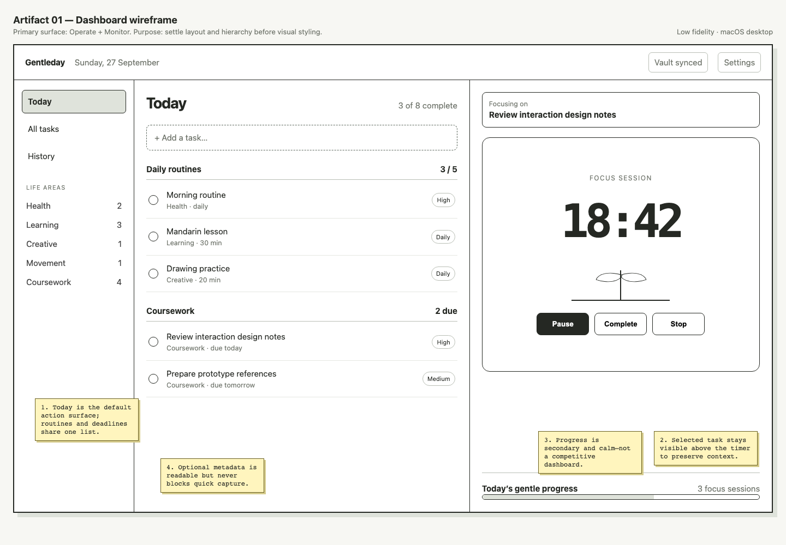
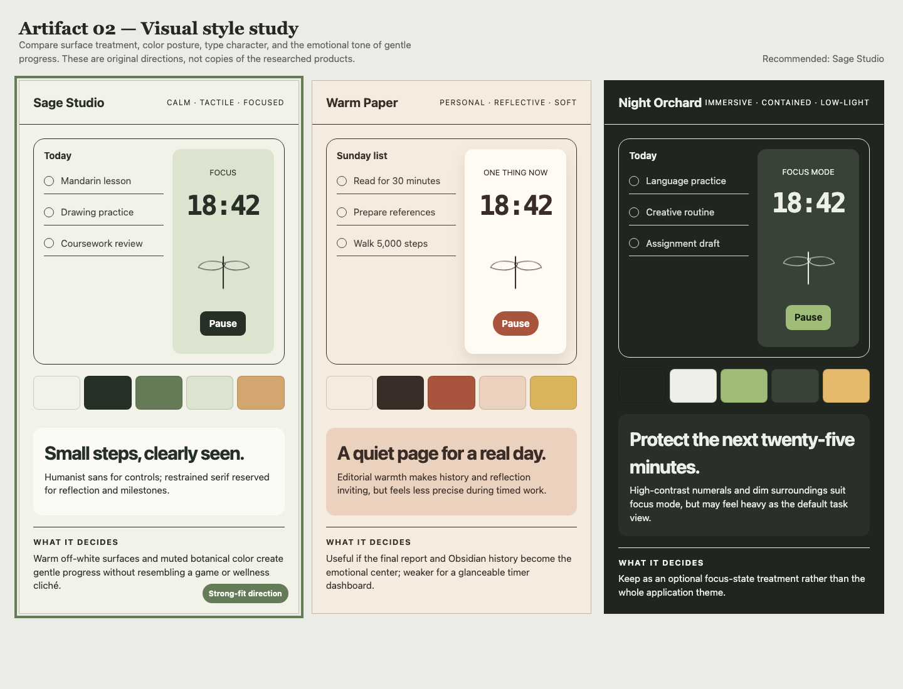
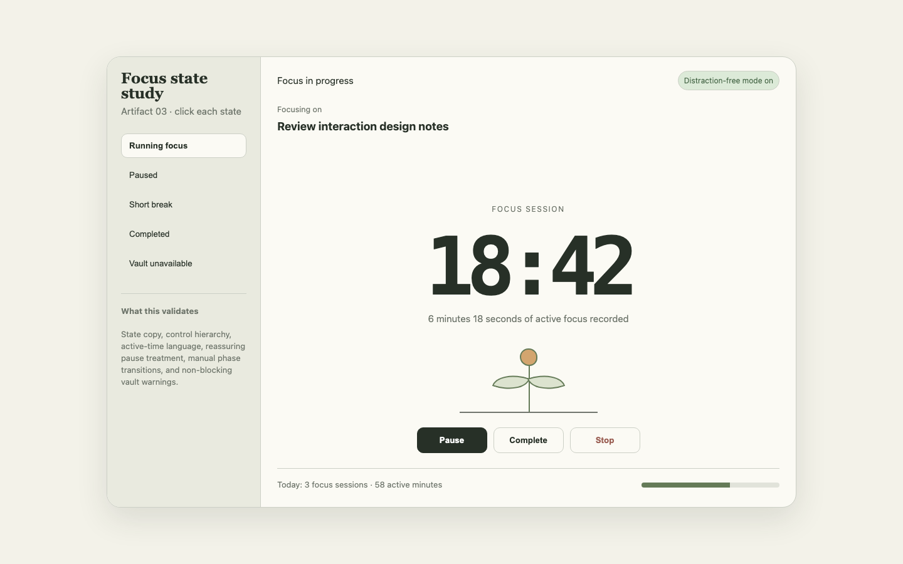
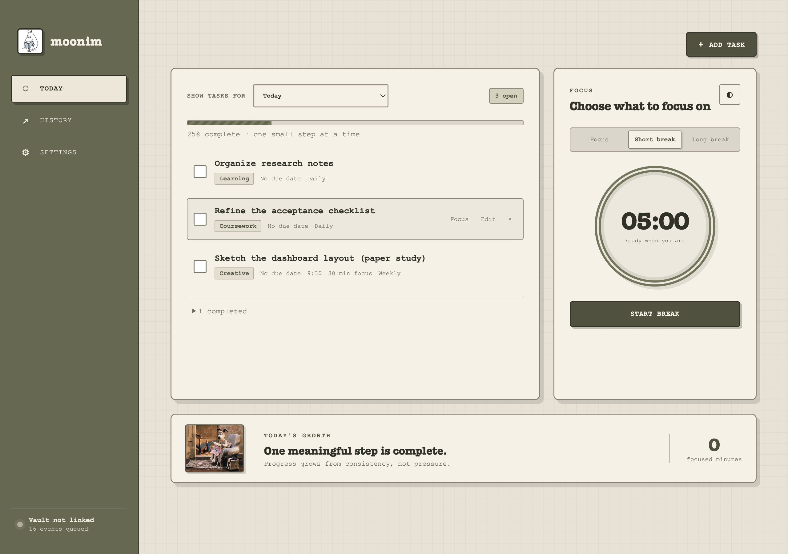

# moonim — 3IXD Dev 5 Assignment 1 Report

**Student:** Saule Pranculyte
**Date:** 28 September 2026
**Repository:** `ps786586785857867978/local-productivity-system-dev5`
**Product:** moonim
**Platform:** macOS desktop

## 1. Executive summary

moonim is a local-first macOS productivity application that combines task management, recurring daily and weekly routines, scheduled task times, optional task-specific focus durations, focus and break tracking, durable local persistence, and append-only Markdown logging to a user-selected Obsidian vault.

The project responds to a personal workflow that mixes coursework with health, language learning, drawing, movement, and reading. Instead of rewarding only perfect Pomodoro sessions, moonim records completed, cancelled, paused, and early-completed work honestly. Paused time is excluded from active duration, unfinished one-off tasks remain visible, and the interface uses calm, non-punitive progress feedback.

The final implementation is an Electron, React, and TypeScript desktop application. The current moonim revision passes 47 automated tests, TypeScript checking, a production build, macOS ARM64 packaging, real Electron QA, packaged-app QA, and a zero-vulnerability dependency audit.

## 2. Research and product direction

I compared three task-management products and three focus products before defining the feature set.

Todoist demonstrated the value of fast capture, optional metadata, priority, recurring dates, and a compact view of current work.[1] Quire showed how one task model can support strong hierarchy and multiple views, but also helped define what to exclude from a small personal tool: deep nesting, enterprise reporting, and collaboration.[2] Evernote Tasks showed the importance of keeping tasks connected to context, while reinforcing that moonim should not become a second note editor because Obsidian already provides that role.[3]

Forest showed how a growing visual metaphor can make focus feel meaningful without requiring a competitive score.[4] PomoTime reinforced familiar work/break phases, editable durations, and completion notifications.[5] Pomofocus provided the clearest reference for connecting a timer to a specific task and reviewing session history.[6]

The research produced three main design principles:

1. task capture should remain fast, with metadata optional;
2. focus history should retain real active time, including interrupted sessions;
3. the app should stay offline and let the user own the resulting history as readable Markdown.

Features such as accounts, collaboration, social focus rooms, reward currencies, enterprise views, and cloud synchronization were deliberately excluded.

## 3. Grill session and requirements

The Grill session converted the broad assignment into testable decisions. The main user plans with a mixture of Today, deadlines, life areas, and priority. Starting life areas were defined as Health, Learning, Creative, Movement, and Coursework.

The task lifecycle includes creation, editing, completion, reopening, deletion, scheduled times, and daily or weekly recurrence. Daily routines create a new occurrence on each local date, while weekly routines return on the same weekday. A selected due date anchors the first recurring occurrence. Deleting a recurring task asks whether to remove one occurrence or the entire routine.

The timer defaults to 25 minutes of focus, a 5-minute short break, and a 15-minute long break. A task may optionally define its own focus duration, so linking a 30-minute drawing task starts a 30-minute timer while tasks without a duration continue using the global default. Pause is resumable and does not count toward active duration. Stop creates a cancelled session with its real active time. Reaching zero or selecting Complete creates a completed session with actual rather than planned duration. The next phase always starts manually after a notification.

The Obsidian requirement became an append-only event outbox. Important task, focus, and break actions first become local events. When a vault is available, those events are appended to predictable daily Markdown files. When it is unavailable, work continues and events remain queued for automatic or manual retry.

## 4. Design development

Three design artifacts were created and reviewed before production styling:

1. a dashboard wireframe to test the combined Today-list and timer hierarchy;
2. a visual style study comparing Sage Studio, Warm Paper, and Night Orchard;
3. a focus-state prototype showing running, paused, break, completed, and unavailable-vault states.

The initial approved direction used warm paper surfaces, sage accents, serif display type, restrained shadows, and low-pressure language. After the first verified release, a user-supplied interface reference established the final direction: a more deliberately retro dashboard with olive panels, paper texture, typewriter-style typography, outlined controls, and compact geometric spacing. The in-app distraction-free state remains available.

The final layout puts a labeled dropdown for Today, This week, This month, or Calendar at the top of the task card, replacing the former task-card heading, while History and Settings remain secondary screens. Week and month retain active undated work, while Calendar separates it into an Unscheduled tray. Focus and Rest history use separate scroll areas and separate local clear controls. The Today’s Growth panel retains the user-supplied Gromit image, while the later user-supplied moonim reading artwork is used for the application icon and renderer brand mark. The warm light atmosphere is the default even when macOS uses a dark appearance; dark mode remains explicitly selectable in Settings with its own contrast palette. The progress display can be disabled, and reduced-motion preferences remove nonessential transitions and animation.









No generated character imagery was used. The final Gromit image was supplied directly by the user for this local coursework application.

## 5. Technical implementation

### 5.1 Application architecture

moonim uses four main layers:

- **Shared product domain:** task commands, recurrence, settings, event generation, and session history;
- **Shared timer domain:** timestamp-derived running and paused states, restart reconstruction, completion, and cancellation;
- **Electron main process:** application lifecycle, state persistence, native folder selection, notifications, validation, and vault writing;
- **React renderer:** Today, History, Settings, task forms, timer controls, progress, and synchronization feedback.

Privileged file operations remain outside the renderer. A narrow preload bridge exposes only the actions needed by the interface.

### 5.2 Local persistence

Application state is stored as versioned JSON. Saves are serialized, written to unique temporary files, and committed by rename. Invalid on-disk state is quarantined rather than trusted. Runtime validation checks nested tasks, sessions, timer invariants, settings, timestamps, dates, and outbox events. On first moonim launch, an existing Gentleday state file is copied into the new application profile only when moonim does not already have state, preserving tasks, sessions, queued events, timer recovery, and vault settings without deleting the original file.

The running timer is derived from persisted timestamps rather than a decrementing counter. This allows a running or paused session to be reconstructed accurately after the process closes and reopens.

### 5.3 Obsidian logging

The user selects a vault through the native macOS folder picker. The main process stores and approves the configured location; the renderer cannot redirect writes to an arbitrary path. The visible moonim rebrand deliberately retains the original `Gentleday` vault root so existing append-only records continue in one location.

Events are written beneath:

```text
Gentleday/Tasks/YYYY/MM/YYYY-MM-DD.md
Gentleday/Focus/YYYY/MM/YYYY-MM-DD.md
Gentleday/Breaks/YYYY/MM/YYYY-MM-DD.md
```

Each record contains a stable event ID, local date and time, ISO timestamp, timezone and UTC offset, event type, status, entity ID, and structured JSON details. The writer checks for an existing event ID before appending, so retrying delivery does not duplicate history.

The vault writer also validates canonical paths, filesystem identity, root replacement, symlinks, event structure, bounded metadata, and Markdown-safe output. Queued events retain their original timestamps during a temporary vault outage.

### 5.4 Desktop security

The production window uses Chromium sandboxing, context isolation, and disabled renderer Node integration. The application restricts IPC to the expected renderer, blocks unexpected navigation and new windows, applies a Content Security Policy, and accepts development renderer overrides only from loopback HTTP origins.

These controls matter because moonim writes user-owned local files. The renderer handles presentation, while the main process owns validation and external side effects.

## 6. Testing and verification

The automated suite contains 47 tests across five files. It covers:

- full task lifecycle and event generation;
- independent clearing of Focus and Rest history without rewriting the append-only outbox;
- one-time legacy profile migration without overwriting existing moonim state;
- daily and weekly recurrence, selected start dates, scheduled times, and edited recurring templates;
- optional task-specific focus durations overriding the global focus default;
- Today, week, month, and calendar visibility, including overdue work, future-occurrence exclusion from Today, and completed-task calendar placement;
- timer pause/resume, completion, cancellation, and active-time accounting;
- Markdown path and record formatting;
- runtime state and event validation;
- serialized atomic persistence;
- duplicate-delivery prevention;
- temporary-vault reconnection;
- symlink and vault-root replacement protection;
- renderer-origin policy.
- renderer placement of the task-range selector, removal of the superseded heading, legacy theme-less state fallback to light, and persisted explicit dark-mode selection.

The real Electron QA flow created and edited tasks, completed and reopened work, deleted a temporary task, completed one focus session, cancelled another, completed a short break, and inspected the resulting state through the actual preload/main-process boundary. The same flow passed against the packaged `moonim.app` build.

The earlier Gentleday artifact commit `2e0e0b6feaf2dcd66e9cd4a66f6a6de9efa7243e` was verified from a clean clone with `npm ci`, all 30 tests, type checking, production build, and macOS packaging. Its packaged application was launched with fresh local data and passed the same main workflow. After a normal application quit and relaunch, it restored five tasks, three sessions, 16 queued events, and no active timer.

The moonim artifact commit `d70cb4033cd5ff620784b766a6095368f8de6094` was also verified from a separate clean clone. That exact checkout passed `npm ci`, all 33 tests, TypeScript checking, the production build, ARM64 packaging, the dependency audit, and diff checks. Its packaged `moonim.app` passed the neutral real Electron QA flow. After quitting and relaunching with the same profile, it restored five tasks, one completed task, three sessions, 16 outbox events, and no active timer.

The later feature commit `ee3a7e48d26cadc22fa821b6025c8b1886149edd` was independently reproduced from another clean clone. It passed `npm ci`, all 43 tests, TypeScript checking, the production build, ARM64 packaging, the dependency audit, and source-diff checks. Its packaged app passed neutral Electron QA and, after quit/relaunch, restored five tasks, one completed task, three sessions, 16 queued events, no active timer, and the expected weekly schedule and task-specific duration.

The task-view follow-up commit `7fd6346fa2bc1769b5a2a651b5a565ca3a8c0e4d` was also reproduced from a fresh clone. It passed all 44 tests, typecheck, build, ARM64 packaging, dependency audit, and source-diff checks. Packaged renderer QA verified the labeled four-option dropdown, visible task rows in week/month, and the dated calendar in both themes.

Real Obsidian synchronization was also tested using the finished application. The latest verification delivered 16 app-generated events and left zero pending. The original task, focus, and break files remain in the selected vault as evidence.

Detailed results are recorded in `docs/testing/ACCEPTANCE_TESTS.md`.

## 7. AI use statement

I used Hermes Agent with an OpenAI Codex model as a development assistant for research organization, requirements questioning, implementation, test generation, debugging, code review, and documentation support.

The AI did not make the product decisions independently. I supplied the assignment direction and personal workflow, answered the Grill questions, approved the design references, and confirmed the implementation direction. Every code and documentation change was kept in Git, reviewed against the PRD, and verified through real commands, tests, builds, packaged application runs, and generated files.

Independent reviews were used as quality gates throughout the project. Earlier Gentleday reviews led to fixes in persistence ordering, local-midnight behavior, vault retry, Electron sandboxing, path safety, runtime validation, and Markdown integrity. On 28 September 2026, separate final reviews of the staged moonim revision found no security concerns, logic errors, missing explicit requirements, visual/usability blockers, or unresolved documentation conflicts.

The later scheduling, task-view, supplied-icon, and theme revision also completed fail-closed review. Review fixes covered Today/future-date semantics, calendar placement, daily-summary independence, recurring due-date persistence, and dark-mode contrast including keyboard focus. The final code/security and visual/accessibility verdicts passed with no blockers.

No AI-generated character artwork was used; the Gromit scene and moonim reading icon artwork were supplied by the user. Credentials and secret values were not included in the repository or report.

## 8. Reflection

The most important lesson was that combining two simple tools creates difficult state boundaries. A task list and a timer are individually straightforward, but reliable recurrence, restart recovery, append-only history, and unavailable-folder behavior require explicit models.

Timestamp-derived timer state was more reliable than saving a displayed countdown. The same principle applied to Obsidian delivery: creating a local event first and treating the vault as a retryable destination made offline behavior predictable.

The review process also changed the implementation substantially. The first working version passed its initial unit tests, but independent review found important issues that normal happy-path testing had missed: unfinished one-off tasks disappearing, recurrence templates becoming stale, UTC/local-date mismatches, persistence races, overly trusted renderer input, and a configured vault being forgotten during an outage. Fixing those issues improved both correctness and the depth of the project.

If I continued the project, I would add automated desktop tests for crossing midnight while the app remains open, native folder-picker interaction, notification delivery, and running/paused timer restoration across a full quit and relaunch. I would also create a signed build, richer history filters, and optional supported macOS Focus integration.

## 9. Limitations

- The first version targets macOS only.
- The packaged application is unsigned; it uses the user-supplied moonim reading artwork as its custom icon.
- macOS Focus/Do Not Disturb integration is deferred; the app includes an in-app distraction-free mode.
- Completion progress is implemented, but streak scoring is deferred.
- There is no cloud sync, account system, collaboration, or cross-device support.
- The final assessment sample is a copy of genuine local app output; the planning journal remains separate.

## 10. Conclusion

moonim meets the assignment goal as one functional offline desktop application rather than two disconnected prototypes. It combines personal task management and focus tracking, preserves state across restarts, records honest active duration, and writes durable append-only history into a user-owned Obsidian vault.

The project moved through research, Grill decisions, approved design references, implementation, independent review, real-app evidence generation, clean-clone verification, and macOS packaging. The latest moonim artifact is backed by repeatable evidence from exact commit `7fd6346fa2bc1769b5a2a651b5a565ca3a8c0e4d` rather than screenshots alone.

## Sources

[1] https://www.todoist.com/task-management — Todoist task management
[2] https://quire.io/features — Quire features
[3] https://help.evernote.com/hc/en-us/articles/1500003792141-Tasks-Overview — Evernote Tasks overview
[4] https://www.forestapp.cc — Forest focus app
[5] https://play.google.com/store/apps/details?id=pomotime.idealapps.ge — PomoTime listing
[6] https://pomofocus.io — Pomofocus
